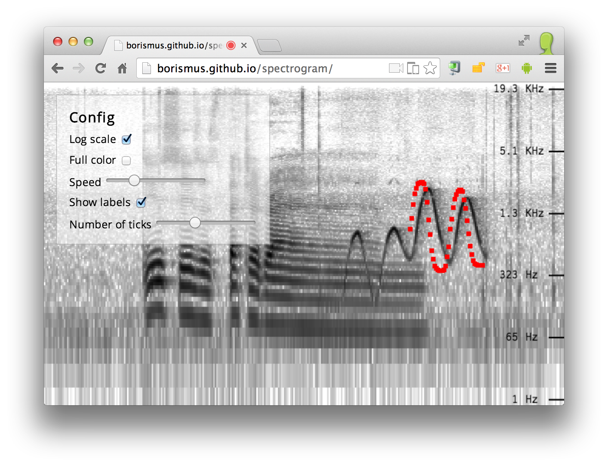

This is a live-input spectrogram written using [Polymer][polymer] and
the [Web Audio API][wapi].

[polymer]: http://polymer-project.org
[wapi]: http://webaudioapi.com

Having a spectrogram handy is incredibly for a lot of the work I've had
to do recently. So I built one that satisfies my needs.

# Using the Spectrogram component

Simplest possible version:

    <g-spectrogram/>

Enable controls:

    <g-spectrogram controls>
    </g-spectrogram>

Pass parameters to the component:

    <g-spectrogram log labels ticks="10">
    </g-spectrogram>

Parameters and what they do:

- `controls` (boolean): shows a config component.
- `log` (boolean): enables y-log scale (linear by default).
- `speed` (number): how many pixels to move past for every frame.
- `labels` (boolean): enables y-axis labels.
- `ticks` (number): how many y labels to show.
- `color` (boolean): turns on color mode (grayscale by default).
- `oscillator` (boolean): enables an oscillator overlay.

# Future work / features

It would be great to add a few things to this spectrogram. If you're
interested in contributing, please submit your changes as a pull
request:

- Improved axis labeling
